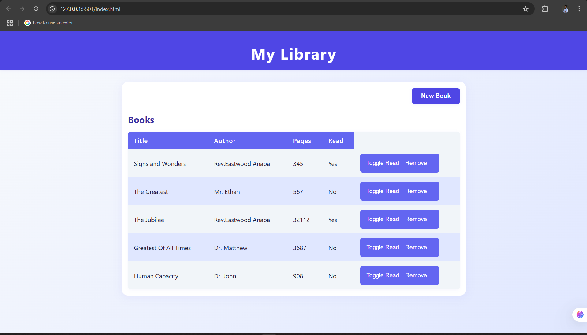

# Library App

A simple, modern web application for managing your personal library. Add, view, update book's status, and remove books in table with an intuitive interface.

## Features

- Add new books with title, author, pages, and read status
- View all books in a  table
- Toggle the read status of any book
- Remove books from your library
- Modal form for adding books

## Project Structure

- `index.html`: Main HTML file
- `style.css`: App styling
- `script.js`: App logic

## Usage

- Click **New Book** to open the add book dialog.
- Fill in the book details and click **Add Book**.
- Use **Toggle Read** to update a book’s read status.
- Use **Remove** to delete a book from your library.

## Screenshot

**Enjoy managing your Library